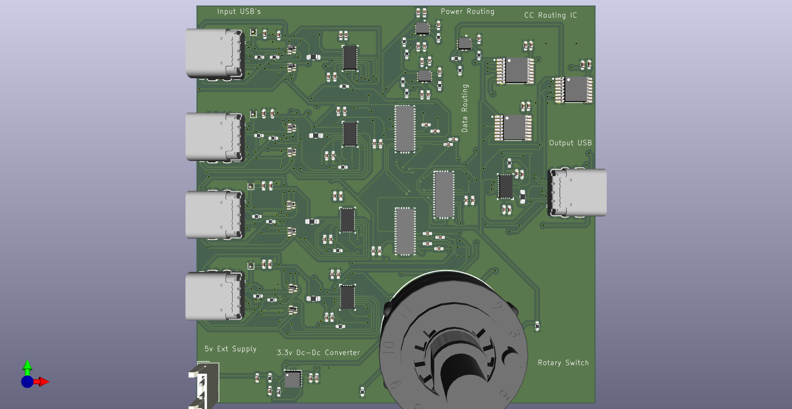
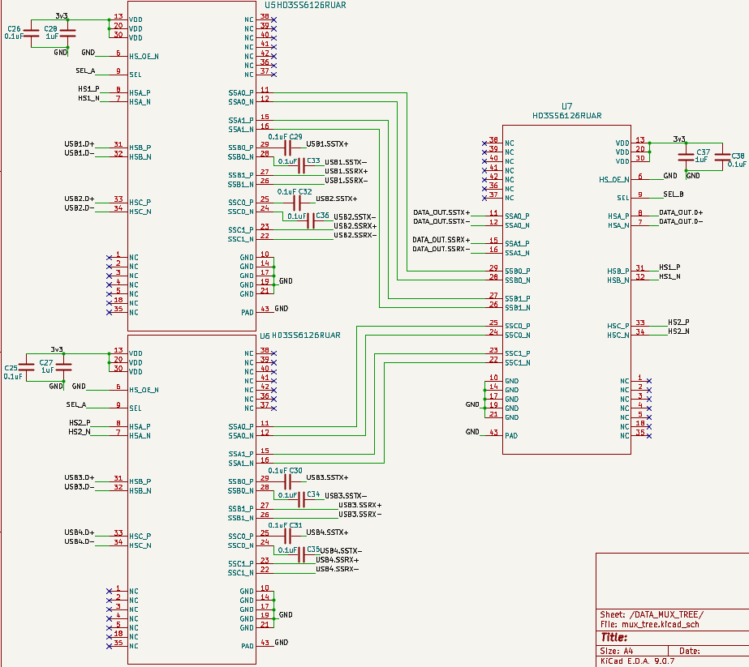
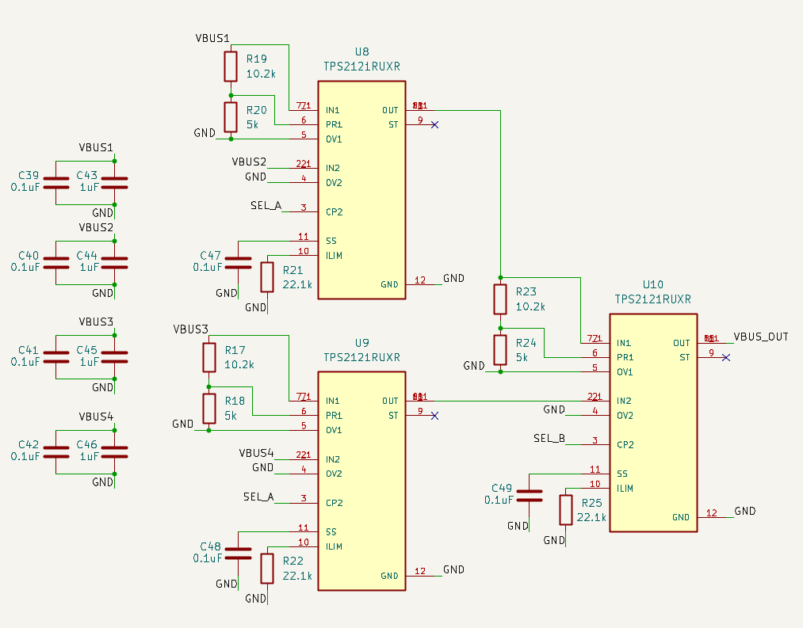
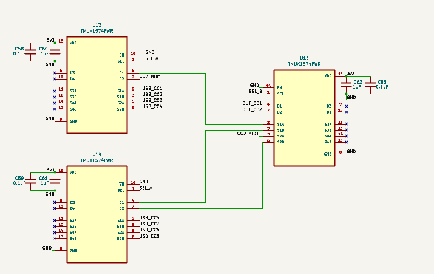
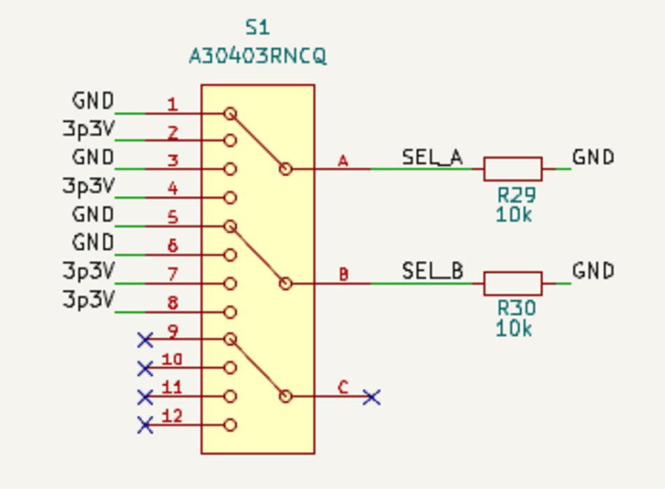
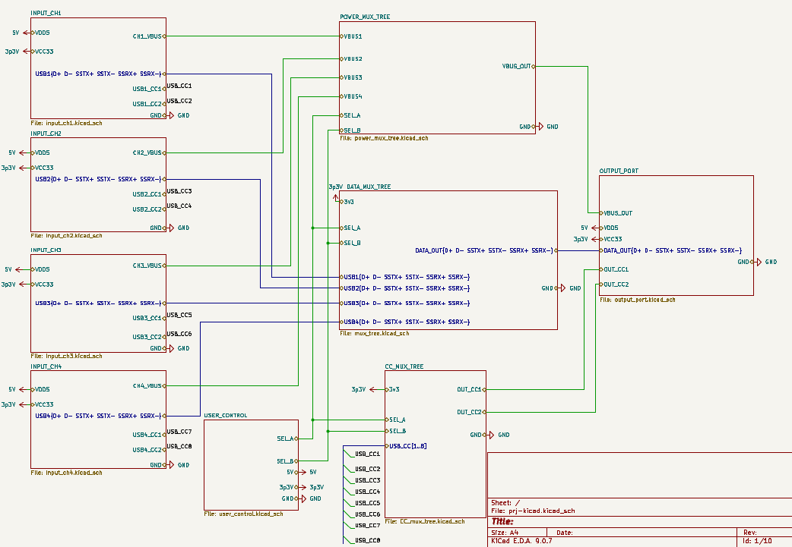

# USB-C-Switcher
# USB Type-C Multi-Port Switching Architecture

A high-speed USB Type-C switching architecture designed for peripheral sharing and power-routing applications.  
The system implements a 4-input to 1-output USB Type-C switching topology capable of routing:

- USB 3.0 SuperSpeed data
- VBUS power
- CC (Configuration Channel) communication

between multiple USB Type-C devices using synchronized hardware-based switching.

---

# Project Overview

This project was developed as part of an academic hardware-system design project at:

**International Institute of Information Technology Bangalore (IIIT-B)**  
Department of Electronics and Communication Engineering

The architecture supports transparent USB Type-C connectivity for:
- USB storage devices
- Keyboards and mice
- USB hubs
- Embedded development boards
- Charging applications
- Standard USB peripherals

The system integrates:
- Orientation detection
- High-speed data multiplexing
- VBUS power routing
- CC signal routing
- Manual hardware-based channel selection

within a compact two-layer PCB implementation.

---

# System Architecture

## Functional Blocks

- USB Type-C Input Channels
- Orientation Detection Block
- High-Speed Data MUX Tree
- VBUS Power MUX Tree
- CC Signal Routing MUX Tree
- User Control and Power Regulation Block

---

# Overall Architecture

%20(2).png)

---

# Hardware Components

| Component | Function |
|---|---|
| HD3SS3220 | USB Type-C orientation detection |
| HD3SS6126 | USB 3.0 high-speed data multiplexing |
| TPS2121 | VBUS power multiplexing |
| TMUX1574 | CC signal routing |
| TPS63001 | 3.3V DC-DC conversion |
| A30403RNCQ | Rotary-switch based channel selection |

---

# PCB Features

- 4 × USB Type-C input ports
- 1 × USB Type-C output port
- USB 3.0 SuperSpeed routing
- Differential pair routing
- Compact 80 mm × 80 mm PCB
- Two-layer PCB implementation
- ESD protection for data and VBUS lines
- Modular switching architecture

---

# PCB Implementation

## 3D PCB View

## PCB Routing Layout

---

# High-Speed Data Routing Architecture

The high-speed data routing path is implemented using HD3SS6126 SuperSpeed multiplexers for routing USB 3.0 TX/RX differential pairs between four USB Type-C input ports and the output channel.

---

# Power Routing Architecture

The power-routing path is implemented using TPS2121 power multiplexers for controlled VBUS switching and power-path protection.

---

# CC Routing Architecture

The CC routing path is implemented using TMUX1574 analog multiplexers to maintain USB Type-C configuration channel communication.

---

# User Control Block

A rotary-switch based control mechanism generates SEL_A and SEL_B signals for synchronized switching across data, power, and CC routing blocks.

---

# Root-Level Schematic

---

# Design Challenges

- USB Type-C reversible orientation handling
- High-speed TX/RX differential routing
- Signal-integrity preservation
- Compact PCB routing constraints
- Simultaneous routing of DATA, VBUS, and CC paths
- Two-layer PCB implementation limitations

---

# Supported Applications

- USB peripheral sharing
- USB device switching
- Embedded development platforms
- Charging applications
- USB communication systems

---

# Limitations

- DisplayPort Alternate Mode is not fully supported
- HDMI Alternate Mode is not implemented
- Two-layer PCB introduces high-speed routing limitations at very high bandwidths

---

# Software and Tools Used

- KiCad 9.0
- LTspice
- Overleaf (IEEE paper preparation)

---

# Repository Contents

| Folder | Description |
|---|---|
| Hardware | KiCad project files |
| Images | Architecture and PCB images |
| Paper | IEEE conference-style paper |
| My Library.pretty | Custom PCB footprints |

---

# Author

**Harsha Vardhan**  
Department of Electronics and Communication Engineering  
International Institute of Information Technology Bangalore

---

# License

This project is intended for academic and educational purposes.
